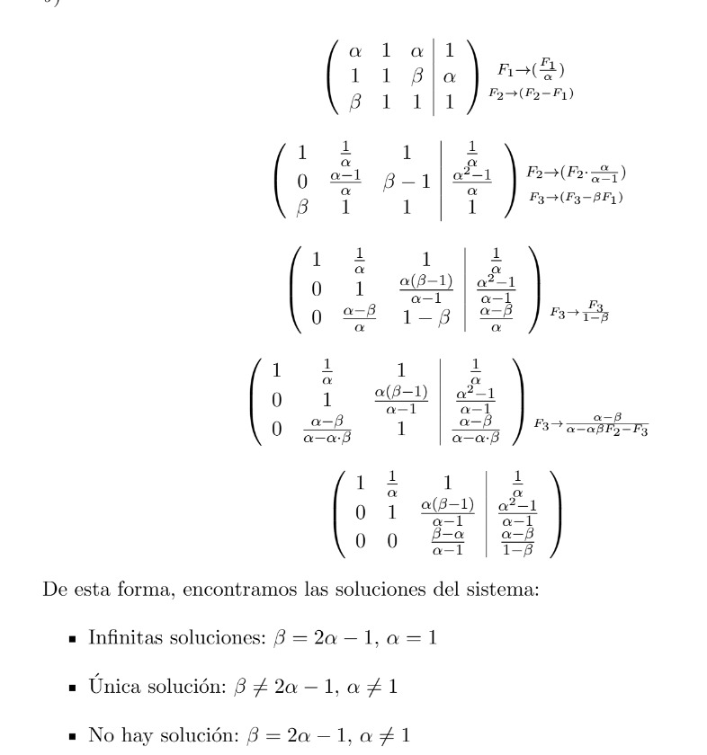
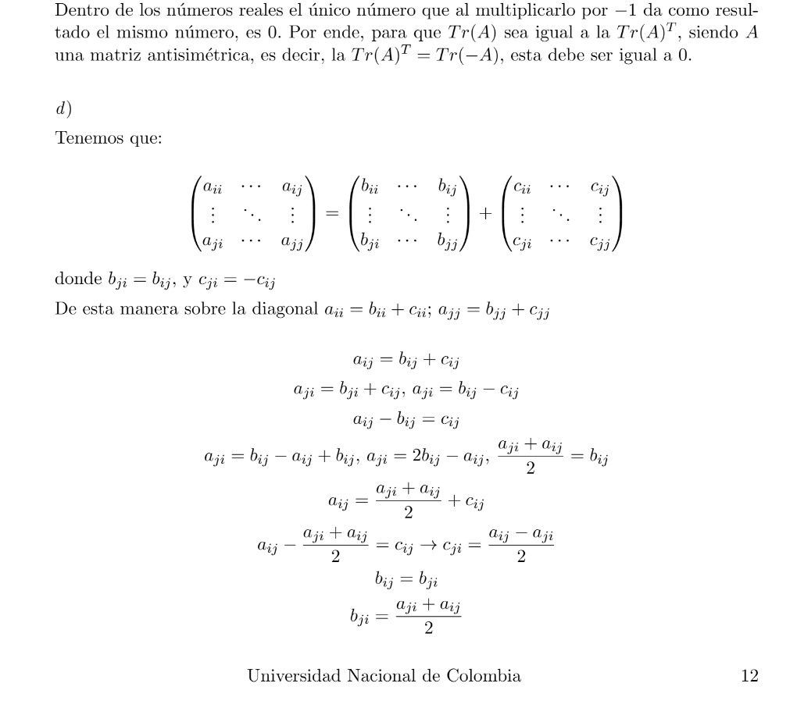
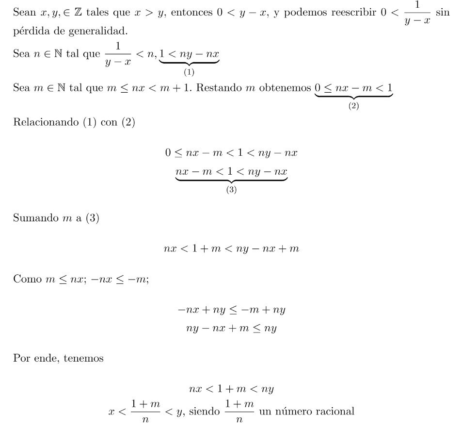
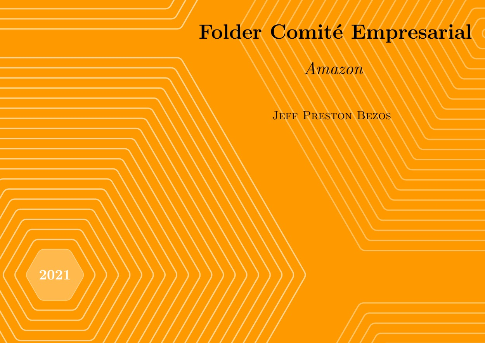
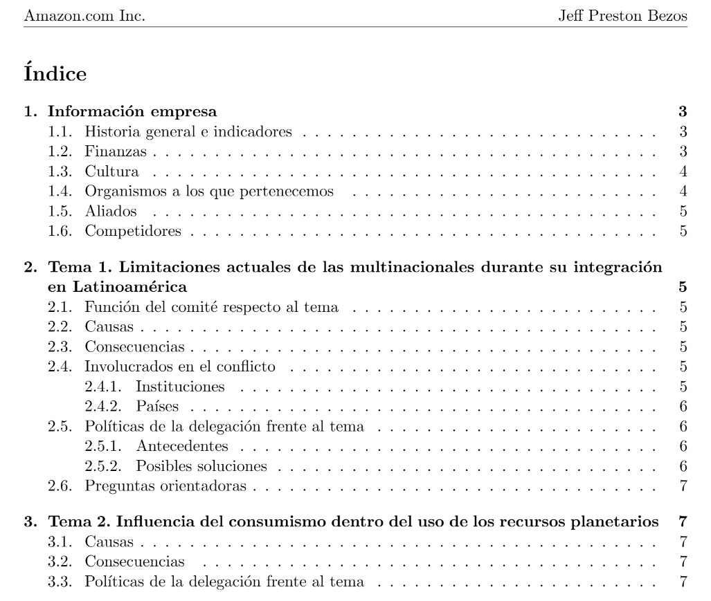

# LaTeX Portfolio & Historical Archive

A personal archive of LaTeX documents I've created since **2019**, when I first started using LaTeX in 9th grade.

This repository collects documents from different stages of my academic journey, not as polished templates, but as a reference for my preferred **visual and technical style**: graphs, tables, mathematical notation, clean layouts, custom designs, and covers I've enjoyed creating on my own.

Each document is uploaded in both formats:

* `filename.tex` — the original LaTeX source code.
* `filename.pdf` — a compiled version for easy viewing without downloading or opening the source code.

## Document Previews

Here are some previews of documents included in the archive:

The repository will grow over time as I add more documents from my historical LaTeX work.
